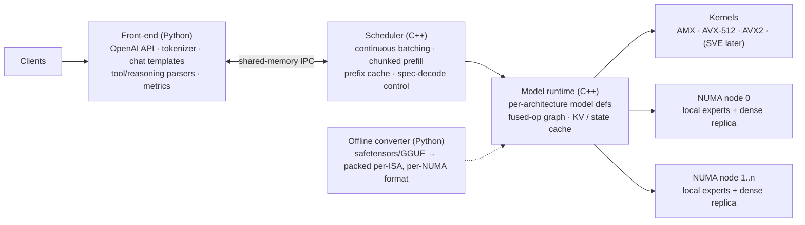

# CPU-only inference engine for large MoE models: plan

Research snapshot: September 2026. The numbers here are estimates from public
specs and published benchmarks. Phase 0 exists to replace them with
measurements on our own hardware. `tools/roofline.py` reproduces every
estimate table in this document.

## 1. Summary

1. **CPU-only is practical for sparse MoE models, not for dense ones.** Decode
   on a CPU is limited by memory bandwidth: each token has to read every
   *active* weight from DRAM once. A model with about 10-15B active parameters
   runs at interactive speed on a current server socket. A dense 122B model
   reads 7-13 times more bytes per token and runs at about 3-7 tok/s per
   socket, which is too slow for interactive use.
2. **Recommended target models:**
   - **DeepSeek-V4-Flash family** (V4-Flash-0731, V4.1-Flash): 284B total,
     13B active, MIT license. It ships routed experts in MXFP4 (4-bit), so the
     weights are about 154 GB at native precision with no quantization loss.
   - **Qwen3.5-122B-A10B**: the main open 122B-class model (122B total, 10B
     active); about 70 GB with 4-bit experts.
   - DeepSeek has no 122B model. V4-Flash is the DeepSeek model that fits
     "122B-class" hardware. DeepSeek-V3.x/R1 (671B, 37B active) also works but
     is about 3 times slower. V4-Pro (1.6T, 49B active) is a later stretch goal.
3. **Buy memory bandwidth.** Choose 12-16 channel DDR5 or MRDIMM, with every
   channel populated at one DIMM per channel. Intel Xeon 6 (AMX) gives much
   faster prefill, which is what users feel as time to first token. AMD EPYC
   9006 "Venice" (16 channels, up to 1.6 TB/s, shipping Q4 2026) gives the most
   decode bandwidth. 384-768 GB per server is enough for V4-Flash and
   Qwen3.5-122B; the 671B models need 1-1.5 TB.
4. **Expected envelope** for V4-Flash on one Xeon 6 MRDIMM socket:
   - About 30-50 tok/s for a single stream.
   - About 100-190 tok/s aggregate at 4-32 concurrent streams, and about 260
     tok/s at 64 streams.
   - Prefill of several hundred to about 2,000 tok/s. Prefill, not decode, is
     the weak point of CPU inference, so a prefix cache is required.
5. **Build vs adopt.** Strong open-source baselines already exist:
   - ik_llama.cpp
   - llama.cpp
   - the SGLang CPU backend
   - KTransformers kt-kernel
   - the vLLM CPU backend

   A new engine is worth building only for what they do poorly:
   - scaling across sockets with NUMA-local experts
   - multi-user continuous batching tuned for CPU MoE
   - native MXFP4/FP8 kernels
   - production serving

   Phase 0 benchmarks all of them and includes a go/no-go gate.
6. **Timeline.** About 6 months to a production v1 for one model family, with
   3-4 engineers (details in section 10).

## 2. Scope, assumptions, open questions

Assumptions (please correct):

- CPU-only x86 servers: Intel Xeon 6 or AMD EPYC 9005/9006. No GPUs.
- Serving through an OpenAI-compatible API, both interactive (chat, agents)
  and batch.
- Quality must stay close to the model provider's reference. Aggressive 2-3
  bit quantization is out of scope for production v1.

Open questions that change the plan:

1. **Which model exactly?** DeepSeek-V4-Flash, DeepSeek-V3.x/R1 671B,
   Qwen3.5-122B-A10B, or another 122B model? If the target is a *dense* 122B,
   CPU-only will not reach interactive speed (see section 4).
2. **Hardware:** what do we have or plan to buy? We need the CPU SKU, memory
   channels and speed, DIMMs per channel, RAM size, sockets, and server count.
3. **Workload and SLOs:** typical prompt length (agents often send 10-50K
   tokens), concurrency per server, and targets for time to first token and
   tok/s.
4. **Is "no GPU" permanent?** A single small GPU for prefill/attention (the
   KTransformers approach) removes the biggest CPU weakness. It is worth
   keeping as an escape hatch.

## 3. Why this works: the arithmetic of CPU inference

- **Decode is bandwidth bound.** Single-stream tok/s ≈ `efficiency x sustained
  DRAM bandwidth / bytes of active weights`. A Xeon 6 socket with MRDIMM-8800
  has about 845 GB/s peak and about 650 GB/s sustained. V4-Flash at native
  precision reads about 9.6 GB per token, so the ceiling is about 68 tok/s and
  a good engine reaches 50-75% of it.
- **Prefill is compute bound.** It costs about `2 x active params` FLOPs per
  token (13B active means 26 GFLOP per token). Intel AMX int8/bf16 tiles give
  roughly 3x the matrix throughput of AVX-512 in MoE kernels. KTransformers
  measured 5.4 vs 1.8 TFLOPS. This is why Intel is the better choice when
  prompts are long.
- **MoE makes large models cheap to read but not cheap to hold.** All 284B
  parameters must be in RAM, but each token reads only 6 of 256 experts per
  layer. With batching, the non-expert weights are read once per step and
  shared by all streams, while expert reads grow with the number of *distinct*
  experts the batch touches.
- **Multi-socket only helps if memory stays local.** Reading remote DRAM over
  UPI/xGMI is where naive engines lose most of the second socket. The fix is to
  treat each NUMA node as an expert-parallel rank (section 7.5).
- **Some bytes/token surprises** from the model shapes:
  - For V4-Flash, the non-expert weights (attention, shared expert, output
    head) are stored in FP8 and are about 65% of the bytes read per token,
    even though the experts are 4-bit.
  - Requantizing only those non-expert weights to 4-bit cuts bytes per token
    by about a quarter (9.6 to 7.0 GB). That is a quality/speed knob we should
    measure, not assume.

## 4. Target models and sizing

Model shapes (estimated; Phase 0 verifies them against each `config.json`):

- **DeepSeek-V4-Flash:**
  - 43 layers, hidden size about 4096.
  - 256 routed experts plus 1 shared expert, top-6, expert intermediate size
    2048. The first 3 MoE layers use hash routing.
  - Hybrid attention: sliding-window, Compressed Sparse Attention (CSA) with a
    lightning indexer, and Heavily Compressed Attention (HCA).
  - Manifold-constrained hyper-connections (mHC) in place of plain residual
    connections.
  - An MTP (NextN) draft head for speculative decoding.
  - MXFP4 routed experts; everything else is FP8/MXFP8 with block scales.
  - 1M context with a very small KV cache.
- **DeepSeek-V3.x/R1:**
  - 61 layers (3 dense), hidden size 7168.
  - 256 experts, top-8.
  - Multi-head latent attention (MLA) with KV rank 512; V3.2 adds DeepSeek
    Sparse Attention (DSA).
  - FP8 weights with 128x128 block scales.
- **Qwen3.5-122B-A10B:**
  - Hybrid architecture: Gated DeltaNet linear-attention layers plus gated
    full-attention layers. Only the attention layers keep a growing KV cache.
  - 256 experts, BF16 native, MTP head, vision encoder.
  - Expert split assumed at about 115B of the 122B.

Weight footprint and bytes read per decoded token (`python3 tools/roofline.py`):

| Model | Precision (bits: experts / rest) | Weights | Read per token |
|---|---|---|---|
| DeepSeek-V4-Flash | native (4.25 / 8.25) | 154 GB | 9.6 GB |
| DeepSeek-V4-Flash | 4-bit everything (4.5 / 4.5) | 160 GB | 7.0 GB |
| Qwen3.5-122B-A10B | int8 (8.5 / 8.5) | 130 GB | 9.8 GB |
| Qwen3.5-122B-A10B | mixed (4.5 / 8.5) | 72 GB | 8.0 GB |
| Qwen3.5-122B-A10B | 4-bit (4.5 / 4.5) | 69 GB | 5.2 GB |
| DeepSeek-V3.x/R1 | native FP8 (8 / 8) | 671 GB | 36 GB |
| DeepSeek-V3.x/R1 | mixed (4.5 / 8.5) | 386 GB | 28 GB |
| Dense 123B (contrast) | 4-bit | 69 GB | **69 GB** |

**KV cache:** small for all three MoE targets.
- V3 MLA stores about 70 KB per token in BF16, so a 128K-token sequence needs
  about 9 GB.
- V4 compresses its KV cache further.
- Qwen3.5 keeps KV only in its attention layers, plus a fixed-size DeltaNet
  state.

## 5. Hardware

Single-stream decode tok/s **per socket**:

- Assumes sustained bandwidth = 78% of peak.
- The lower number is engine efficiency 0.45, which is where today's engines
  are.
- The upper number is efficiency 0.75, our target.

| Platform | Sustained GB/s | V4-Flash native | Qwen3.5-122B mixed | V3.x/R1 mixed | Dense 123B 4-bit |
|---|---|---|---|---|---|
| TR Pro 3995WX, 8ch DDR4-3200 (calibration) | 160 | 7-12 | 9-15 | 3-4 | 1-2 |
| EPYC 9005 Turin, 12ch DDR5-6000 | 449 | 21-35 | 25-42 | 7-12 | 3-5 |
| Xeon 6 6900P, 12ch DDR5-6400 | 479 | 22-37 | 27-45 | 8-13 | 3-5 |
| Xeon 6 6900P, 12ch MRDIMM-8800 | 659 | 31-51 | 37-62 | 11-18 | 4-7 |
| EPYC 9006 Venice, 16ch DDR5-8000 | 799 | 37-62 | 45-75 | 13-21 | 5-9 |
| EPYC 9006 Venice, 16ch MRDIMM-12800 | 1278 | 60-100 | 72-120 | 20-34 | 8-14 |

**Calibration:** ik_llama.cpp measured 9.7 tok/s CPU-only for V4-Flash Q4_K_M
on a 3995WX. The model predicts about 10 tok/s at efficiency 0.45 for 4-bit
weights.

**Two sockets:** add about 1.7-1.9x, but only with NUMA-local expert
placement (section 7.5).

Recommendations:

- **Lab / first production box:**
  - 2-socket Xeon 6 6900P-class with 12x MRDIMM-8800 per socket.
  - 768 GB RAM (24x 32 GB) for V4-Flash or Qwen3.5-122B, or 1.5 TB for the
    671B models.
  - AMX covers prefill; Sub-NUMA Clustering (SNC) exposes 3 NUMA nodes per
    socket, which the engine must handle.
- **Second box:** one AMD EPYC (Turin now, Venice when available) to keep the
  AVX-512 path honest. Many fleets are AMD, and Venice will be the bandwidth
  leader until Diamond Rapids.
- **2027:** Intel Xeon 7 "Diamond Rapids" (16 channels, up to 1.6 TB/s,
  AMX-FP8) runs FP8 weights natively. Design the kernel layer so that it is a
  new backend, not a rewrite.
- Populate every channel at one DIMM per channel. Half-populated channels
  halve decode speed.
- DRAM pricing has been volatile in 2025-2026, so get quotes early. Memory is
  now the dominant cost of these servers.

## 6. Existing engines: what to learn, what to measure

| Engine | CPU-only? | Strengths | Gaps relevant to us |
|---|---|---|---|
| **ik_llama.cpp** | Yes | Best single-stream CPU performance; supports DeepSeek-V4/V4.1, Qwen3.5-MoE (fused DeltaNet), MTP; quantization formats tuned for CPU (IQ*_K, R4 row-interleaved layouts) | Weak multi-user batching and NUMA scaling; small maintainer team; not a serving platform |
| **llama.cpp** | Yes | DeepSeek-V4 merged Jun 2026 (PR #24162); huge ecosystem; GGUF | CPU MoE and NUMA paths are slower than ik_llama.cpp; early V4 reports mention KV/quantized-cache bugs |
| **SGLang CPU backend (Intel)** | Yes | AMX kernels for BF16/INT8/FP8; 85% bandwidth efficiency in the MoE kernel; 6-14x TTFT and 2-4x TPOT vs llama.cpp (DeepSeek-R1, 2x Xeon 6980P); real serving stack (RadixAttention, continuous batching) | Intel-first; Python/PyTorch overhead; the CPU path can trail the GPU path for new architectures (check V4 support) |
| **KTransformers / kt-kernel** | Mostly hybrid CPU+GPU | Best-in-class CPU MoE kernels (AMX INT4/INT8, AVX-512 FP8/BF16/MXFP4, AVX2); NUMA-aware thread pools; SGLang integration; day-0 model support | Attention is designed to run on a GPU; CPU-only is not its main path |
| **vLLM CPU backend** | Yes | Serving features, broad model coverage | Slower than llama.cpp in published CPU comparisons |

Ideas to borrow:

- KT's NUMA thread pools and AMX tile packing.
- ik_llama.cpp's row-interleaved quantization layouts, FlashMLA on CPU, fused
  DeltaNet, and MTP.
- SGLang's scheduler and radix prefix cache.
- The CFLOW research runtime: weights stored as L2-sized tiles in the order
  they are consumed (7.3x fewer L1 misses than row-major).

### Build-vs-adopt gate (end of Phase 0)

Measure every baseline on our hardware and models (section 9 protocol).

- **Adopt and contribute** if the best baseline reaches at least 80% of our
  targets on all of:
  - single-stream decode
  - aggregate throughput at our concurrency
  - 2-socket scaling
  - time to first token

  In that case put the effort into upstream patches (NUMA expert parallelism,
  kernels) and a thin serving layer.
- **Build the engine below** if we are clearly short on at least one of those
  axes. The likely gaps are 2-socket scaling and multi-user batching.

## 7. Engine architecture



### 7.1 Language and process layout

- **Hot path: C++20, no PyTorch.** One persistent pinned thread pool per NUMA
  node, spin barriers between ops, and no per-op allocation. At 20-30 ms per
  token across 43-61 layers, framework overhead is a measurable share of
  latency.
- **Front-end: a separate Python process.** It handles the OpenAI API,
  tokenization, Jinja chat templates, and tool/reasoning parsers, reusing
  maintained libraries. It is off the hot path, and model churn mostly lands
  in templates and parsers, which is cheap to follow in Python. SGLang uses
  the same split.
- The engine exposes a C ABI so we can build test bindings and an in-process
  mode later.

### 7.2 Weight format: compile once, stream sequentially

- An offline converter reads HF safetensors (and GGUF, for comparisons). It
  writes an engine-native file:
  - packed per ISA (AMX tiles, AVX-512 row-interleaved blocks)
  - split per NUMA node
  - laid out in exactly the order kernels consume it, so every expert is one
    contiguous, prefetch-friendly stream
- Loading: mmap on 1 GB hugepages with explicit placement per NUMA node
  (mbind), pre-faulted and mlocked. No page faults on the hot path.

### 7.3 Precision strategy

- **Keep the model's native formats first.**
  - V4-Flash MXFP4 experts need no requantization. E2M1 values times 2 are
    exact integers in [-12, 12], so an MXFP4 x int8 dot product is *exact*
    with a 16-entry lookup table (vpshufb/vpermb), VNNI/AMX int8 multiply-adds,
    and a power-of-two UE8M0 scale.
  - FP8 e4m3 goes through lookup-table conversion to BF16 for AMX-BF16 or
    AVX512-BF16 (native AMX-FP8 on Diamond Rapids).
- Activations are quantized per token/block to int8 on the fly, fused into
  RMSNorm and SwiGLU.
- Optional requantized variants, each gated on KL divergence against the
  reference model (section 9):
  - int8 per-channel for FP8 weights
  - 4-bit for dense/attention weights (about 35% faster decode on V4-Flash)
  - 4-bit experts for BF16 models such as Qwen3.5
- KT reports large accuracy drops for naive AMX INT4 on some models, so we
  never ship a quantization without that gate.

### 7.4 Kernels (priority order)

1. **MoE grouped GEMV/GEMM:**
   - The router, top-k selection and token-to-expert gather are fused.
   - Two paths: an AVX-512 VNNI path for small token counts per expert
     (decode) and an AMX path for 16 or more (prefill and batched decode).
   - A scalar reference implementation for tests. An AVX2 fallback.
2. **Attention per architecture:**
   - V4: sliding-window, CSA compressor + lightning indexer + top-k sparse
     attention, and HCA.
   - V3: absorbed-MLA decode (FlashMLA-style CPU kernel) and the DSA indexer.
   - Qwen3.5: a Gated DeltaNet recurrent kernel for decode and a chunked
     parallel form for prefill, plus gated attention.
3. **Fused glue:** RMSNorm+quantize, SwiGLU, RoPE, mHC mixing, sampling
   (top-p/k, penalties), and logits computed only for positions that need
   them.
4. **Later:** ARM SVE2/i8mm (Graviton, Grace) and AMX-FP8.

Every kernel ships with a microbenchmark that reports achieved GB/s or FLOPs
against the roofline, so we know when to stop optimizing.

### 7.5 NUMA and multi-socket: expert parallelism inside one box

- Each NUMA node (a socket, or an SNC domain) is an **expert-parallel rank**:
  - It owns about 1/N of the routed experts in local memory and streams only
    those.
  - Dense weights (about 7 GB for V4-Flash) are replicated per node, which is
    cheap and keeps all weight reads local.
- Per layer, ranks exchange only the hidden states (a few KB per token)
  through shared memory, instead of pulling weights across UPI or xGMI.
- Expert placement comes from routing statistics gathered on representative
  traffic. Hot experts can be replicated to balance load.
- Target: at least 1.7x from 2 sockets vs 1, measured.
- **Multi-node (later):** the same expert-parallel design over RDMA for 671B
  models or V4-Pro. For V4-Flash and 122B-class models, scale out with
  independent replicas behind a load balancer instead. That is simpler and
  just as efficient.

### 7.6 Scheduler and caches

- **Continuous batching with chunked prefill:**
  - Decode steps get priority.
  - A per-step token budget holds decode latency (TPOT) inside the SLO.
  - Admission control uses the throughput model (section 8), so a server never
    accepts more streams than it can serve at the target tok/s.
- **Radix-tree prefix cache** in RAM, spilling to NVMe:
  - System prompts, tool schemas and agent histories are prefilled once.
  - This is the main defense against slow CPU prefill.
  - V4's compressed KV cache makes caching long prefixes cheap.
- **Speculative decoding:**
  - Native MTP heads (V4 NextN, Qwen3.5 MTP), plus n-gram and suffix drafting
    for code and editing workloads.
  - Draft length adapts using a cost model. For MoE, verifying k tokens
    touches up to k x top-k experts, so drafts are not free (table below).
- KV/state cache: paged, with FP8/int8 KV options gated on quality. Session
  save/restore for agents.

## 8. Throughput model

**Batched decode.** V4-Flash native, one Xeon 6 MRDIMM socket, efficiency
0.75, uniform routing. Real routing is skewed, so this is pessimistic.

| Concurrent streams | Distinct experts / layer | GB per step | Aggregate tok/s | tok/s per stream |
|---|---|---|---|---|
| 1 | 6 | 10 | 51 | 51 |
| 4 | 23 | 19 | 101 | 25 |
| 8 | 44 | 32 | 125 | 16 |
| 16 | 81 | 53 | 150 | 9 |
| 32 | 136 | 84 | 187 | 6 |
| 64 | 200 | 121 | 261 | 4 |

What this means in practice:

- One socket serves about 4-8 interactive users at 15-25 tok/s each, or runs
  offline batch jobs at 250+ tok/s.
- A 2-socket server roughly doubles this.
- Capacity planning is replicas x sockets x this table.

**MTP speculative decoding** (bandwidth model, V4-Flash native):

| Draft tokens | Verify cost vs 1 token | Speedup at 70% acceptance | at 80% | at 90% |
|---|---|---|---|---|
| 1 | 1.35x | 1.26x | 1.33x | 1.41x |
| 2 | 1.69x | 1.29x | 1.44x | 1.60x |
| 3 | 2.03x | 1.25x | 1.46x | 1.70x |

**Prefill** is compute bound. Ceiling in tok/s at a given *effective* int8/bf16
throughput, ignoring attention:

| Model | 10 TOPS | 25 | 50 | 100 |
|---|---|---|---|---|
| Qwen3.5-122B-A10B | 500 | 1,250 | 2,500 | 5,000 |
| DeepSeek-V4-Flash | 385 | 962 | 1,923 | 3,846 |
| DeepSeek-V3.x/R1 | 135 | 338 | 676 | 1,351 |

- Reaching 25-50 effective TOPS is realistic on 2x Xeon 6 with AMX, and
  harder with AVX-512 alone.
- At 1,000 tok/s, a 32K-token prompt still takes about 30 s to the first
  token. That is why the prefix cache and chunked prefill are required
  features, not nice-to-haves.

## 9. Validation

- **Kernel tests:**
  - Every kernel is compared against a scalar reference for each ISA.
  - CI runs on AVX2 and AVX-512 runners; AMX correctness runs under Intel SDE.
  - Tests include randomized shapes, including odd expert token counts.
- **Model correctness:**
  - Layer-by-layer golden tests against a reference implementation (the model
    provider's inference code or HF transformers) running at high precision
    on a large-memory CPU box.
  - End to end on a fixed prompt set: top-1 token agreement, mean and p99 KL
    divergence of next-token distributions, and perplexity.
- **Quality:**
  - A small, fixed eval suite: math, knowledge, code, tool calling,
    long-context needle retrieval.
  - Compared against provider-reported numbers and the provider's API.
  - Every precision variant must pass before it can ship.
- **Performance protocol (also used for the Phase 0 baselines):**
  - STREAM / Intel MLC bandwidth per NUMA node.
  - Single-stream decode at 0, 8K and 32K context.
  - Time to first token for 1K, 8K and 32K prompts, cold and prefix-cached.
  - A concurrency sweep from 1 to 64: aggregate throughput vs p50/p99 TPOT.
  - Every run reports % of roofline, plus perf/VTune/uProf profiles for the
    top kernels.
- **Soak test:** 72 hours at target load with no memory growth and no latency
  drift.

## 10. Roadmap

Assumes 3-4 engineers: 2 on kernels/runtime, 1 on scheduler/serving, and 0.5-1
on model correctness and evaluation.

| Phase | Weeks | Deliverables | Exit criteria |
|---|---|---|---|
| **0. Measure and decide** | 0-3 | Hardware bandwidth report. All 5 baselines run on the target models with the section 9 protocol. Model shapes verified; roofline recalibrated. | Signed-off targets. Go/no-go on building (section 6 gate). |
| **1. Correct on one socket** | 3-9 | Converter and packed format; runtime; thread pool; kernels v1 (AVX-512 + AMX); first model end to end at batch 1; golden and KL tests in CI. | KL within budget vs reference; at least 50% of roofline for decode. |
| **2. Fast on two sockets** | 9-14 | Kernel optimization; native MXFP4/FP8 paths; NUMA expert parallelism; hugepage/mbind loader; prefill with AMX. | At least 70% of roofline per socket; 2S/1S at least 1.7x; prefill target met. |
| **3. Serving v1** | 14-20 | Python front-end with OpenAI API (chat, completions, responses, streaming, tools, reasoning); continuous batching; chunked prefill; prefix cache; MTP; metrics; container image. | SLOs met in the concurrency sweep; 72h soak passes; eval parity. |
| **4. Second model and hardening** | 20-26 | Second model family (Qwen3.5-122B-A10B, or V3.x/R1); deployment runbooks; autoscaling signals; Venice tuning. | Both models in production behind the gateway. |
| **Later** | 26+ | Multi-node expert parallelism (671B, V4-Pro); ARM backend; AMX-FP8 (Diamond Rapids); CXL/NVMe KV tiering; optional GPU-assisted prefill. | Driven by demand. |

**While the engine is being built:** run the best Phase 0 baseline (probably
ik_llama.cpp for single-user use, or SGLang-CPU for multi-user) to unblock
users now. Its numbers become the regression floor for our engine.

Proposed repository layout:

```
engine/     C++ runtime: scheduler, caches, NUMA/thread pools, C ABI
kernels/    amx/ avx512/ avx2/ reference/ + microbenchmarks
models/     deepseek_v4/ qwen35/ deepseek_v3/ (one module per architecture)
convert/    Python: safetensors/GGUF -> packed per-ISA, per-NUMA format
server/     Python front-end: OpenAI API, tokenizer, templates, parsers
bench/      performance protocol and harness (tools/roofline.py moves here)
tests/      kernel, golden-layer, end-to-end KL and eval tests
```

## 11. Risks

| Risk | Impact | Mitigation |
|---|---|---|
| Slow prefill (time to first token) on long agent prompts | Poor user experience even when decode is fine | AMX hardware; prefix cache; chunked prefill; cap prompt size in v1; keep GPU-assisted prefill as an escape hatch |
| New architectures every few months (V4 attention variants, mHC, DeltaNet) | The engine falls behind upstream | One module per architecture; golden tests make ports mechanical; budget about 20% of ongoing capacity; reuse the Python front-end for templates and parsers |
| Open-source baselines keep improving | The engine's advantage disappears | Phase 0 gate; re-benchmark every quarter; upstream kernels where cheaper |
| Quantization quality regressions | Silent answer degradation | Native formats first; KL and eval gates on every variant |
| NUMA scaling below target | Half of the purchased bandwidth unused | Expert parallelism per node; measure 2S/1S in Phase 2; fall back to one replica per socket |
| DRAM cost and availability; Venice and Diamond Rapids timing | Budget and schedule | Size RAM to the chosen model (768 GB is enough for V4-Flash and 122B); design for AVX-512 + AMX today |
| Long context on CPU (128K and more) | Attention cost dominates | Architectures that compress attention (V4 CSA/HCA, Qwen3.5 DeltaNet) help; cap context in v1; sparse-attention kernels |

## 12. Sources

- DeepSeek-V4-Flash model card, 284B/13B, CSA/HCA, mHC:
  <https://huggingface.co/deepseek-ai/DeepSeek-V4-Flash>
- DeepSeek-V4 paper: <https://arxiv.org/pdf/2606.19348>
- V4-Flash shape and precision (43 layers, 256 experts, top-6, MXFP4 experts):
  <https://docs.nvidia.com/nemo/automodel/recipes-e2e-examples/deepseek-v4-flash>
  and <https://www.contextstudios.ai/blog/deepseek-v4-flash-fits-because-its-experts-are-4-bit>
- DeepSeek-V3 config:
  <https://github.com/deepseek-ai/DeepSeek-V3/blob/main/inference/configs/config_671B.json>
- Qwen3.5 (122B-A10B release, hybrid DeltaNet + MoE):
  <https://github.com/QwenLM/Qwen3.5> and
  <https://huggingface.co/Qwen/Qwen3.5-122B-A10B>
- ik_llama.cpp and its DeepSeek-V4 PR (3995WX CPU-only numbers):
  <https://github.com/ikawrakow/ik_llama.cpp> and
  <https://github.com/ikawrakow/ik_llama.cpp/pull/2165>
- llama.cpp DeepSeek-V4 support: <https://github.com/ggml-org/llama.cpp/pull/24162>
- SGLang CPU backend on Xeon 6 (DeepSeek-R1, AMX):
  <https://www.lmsys.org/blog/2025-07-14-intel-xeon-optimization/>
- KTransformers, kt-kernel, V4-Flash tutorial:
  <https://github.com/kvcache-ai/ktransformers>
- KTransformers SOSP'25 paper (AMX vs AVX-512 MoE throughput):
  <https://madsys.cs.tsinghua.edu.cn/publication/ktransformers-unleashing-the-full-potential-of-cpu/gpu-hybrid-inference-for-moe-models/SOSP25-chen.pdf>
- vLLM CPU backend (example PR): <https://github.com/vllm-project/vllm/pull/57294>
- CFLOW / Pipeline-Native Transformers (tiled weight layout for CPU decode):
  <https://arxiv.org/abs/2608.23841>
- AMD EPYC 9006 Venice (16ch, up to 1.6 TB/s, Q4 2026):
  <https://www.servethehome.com/amd-takes-the-lid-off-of-next-gen-epyc-9006-venice-as-zen-6-comes-to-servers/>
- Intel Xeon 7 Diamond Rapids (16ch, AMX-FP8, 2027):
  <https://www.servethehome.com/intel-diamond-rapids-the-2027-intel-xeon-at-hot-chips-2026/>
